# AzureDatabricksMLOps
**Authored by Paolo Colecchia**

## Introduction
This repository contains an example of how to build an Azure Databricks MLOps pipeline for batch scoring of Spark ML models. This tutorial assumes you already know what Azure Databricks is and how to develop a ML model.
In this Git repo you will find two main folders: Notebooks and Pipelines. The former contains all the relevant Python files to get some data from an Azure Data Lake, perform data preparation, train a SparkML model, register it to the MLFlow model registry and perform batch scoring; the latter contains a yaml file to import into your Azure DevOps project to create a Build pipeline and a Release pipeline JSON file to configure based on your own environment settings

# What is MLOps?
Machine Learning Operations (MLOps) is based on DevOps principles and practices that increase the efficiency of workflows. For example, continuous integration, delivery, and deployment. MLOps applies these principles to the machine learning process, with the goal of:

- Faster experimentation and development of models
- Faster deployment of models into production
- Quality assurance and end-to-end lineage tracking

# How to use this repository?
To build an MLOps pipeline of your Azure Databricks SparkML model you'd need to perform the following steps:
- Step 1: Create an Azure Data Lake
- Step 2: Create two Azure Databricks workspaces, one for Dev/Test and another for Production
- Step 3: Mount the Azure Databricks clusters to the Azure Data Lake
- Step 4: Create an Azure DevOps project and import this repository
- Step 5: Add your newly created Azure DevOps repository to your Azure Databricks cluster
- Step 6: Run the Notebooks from the Azure DevOps repo
- Step 7: Import the created MLOps pipelines in your Azure DevOps project
- Step 8: Build an Azure Data Factory pipeline to run the Azure Databricks notebooks in the Test/Pre-Prod and Production environment

Notes: 
- As this is a demo tutorial, I only created two Databricks workspaces but in reality you will create one Databricks workspace per environment which is normally: Development, Test/Prep-Production and Production
- To deploy Notebooks into the Azure Databricks workspace I used the pre-built tasks from the Marketplace by Data Thirst. For production deployment I'd recommend using a Python step which invokes the Azure Databricks workspace/cluster APIs to interact with the cluster and deploy notebooks into the workspace.  
- In a real production deployment you will be using Azure Key Vault to store secrets as well
- In this demo tutorial I am using the Azure Data Lake as a data source however if you are familiar with Azure Databricks you can modify the provided code to load the provided data into your Azure Databricks cluster without using the Data Lake

Let's now delve into the steps above.

# Step 1: Create an Azure Data Lake

Login to the Azure portal and click on create a resource. Choose Azure Storage Account and then click Create.

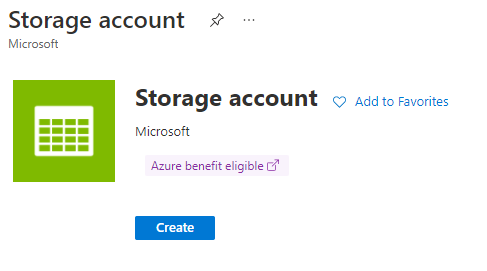

Fill in the different fields to create the storage account in the right resource group based on your configuration

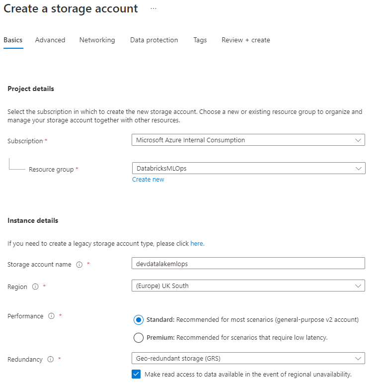

Click on the Advanced tab and select the Enable hierarchical namespace. Click on Create

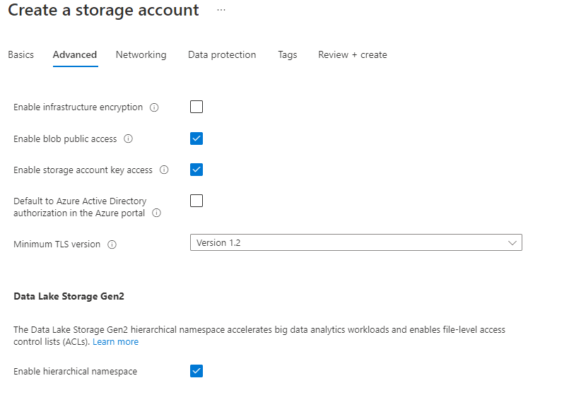

# Step 2: Create two Azure Databricks workspaces

Login to the Azure portal and click on create a resource. Choose Azure Databricks and then click Create.

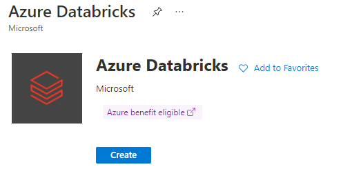

Fill in the different fields to create the Azure Databricks workspace for DevTest environment(make sure you chose the Premium Tier) in your resource group based on your configuration then click on Create

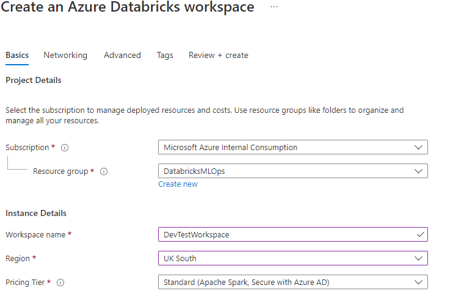

Now repeat the steps above to create another Azure Databricks workspace for the Production Environment(make sure you chose the Premium Tier). 

# Step 3: Mount the Azure Databricks cluster to the Azure Data Lake

The first thing to do is to download the diabetes.csv and HoldoutDiabetes.csv files from the data folder of this repo on your local file system: 

Now go into your resource group and click on your Azure Data Lake. Click now on the Storage Account Browser -> Blob containers -> + Add container ->  add a "data" container name -> click on Create

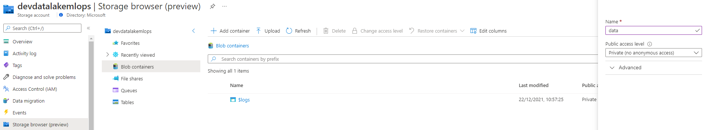

After creating the data container, click on it and add a "test" Directory. Click on Create

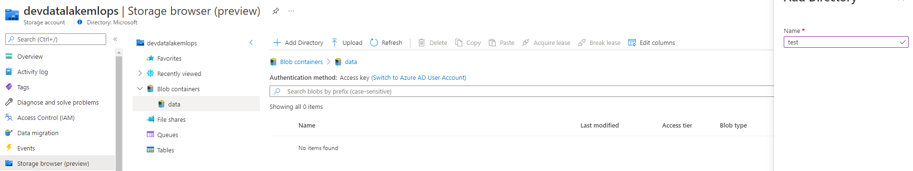

After creating the test directory, click on it and then click on the Upload button -> click on browse for files -> select the diabetes.csv and HoldoutDiabetes.csv files from your file system -> click on Upload

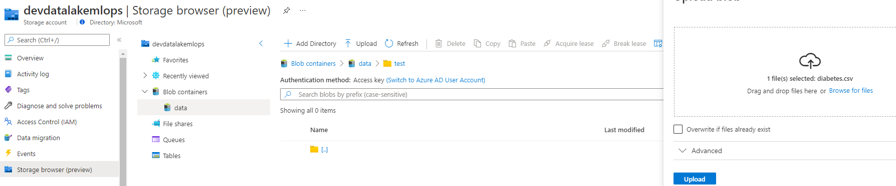

The next step now is to create an Azure Databricks cluster and a mounting point with the Azure Data Lake.
Go into your resource group and click on the Azure Databricks service you created and click on Launch Workspace. Once you are logged in the Azure Databricks Workspace, click on Compute from the left menu bar and click on Create Cluster

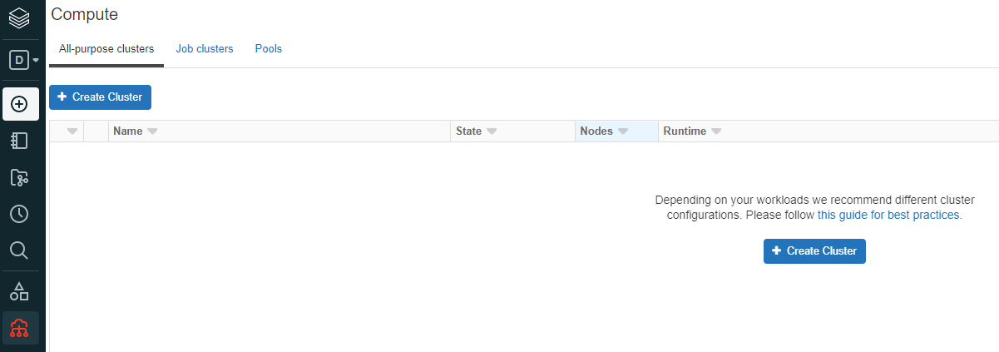

Fill in the different fields with your configuration. As an example you can set the cluster fields as I have done in the screenshot below - then click Create Cluster:

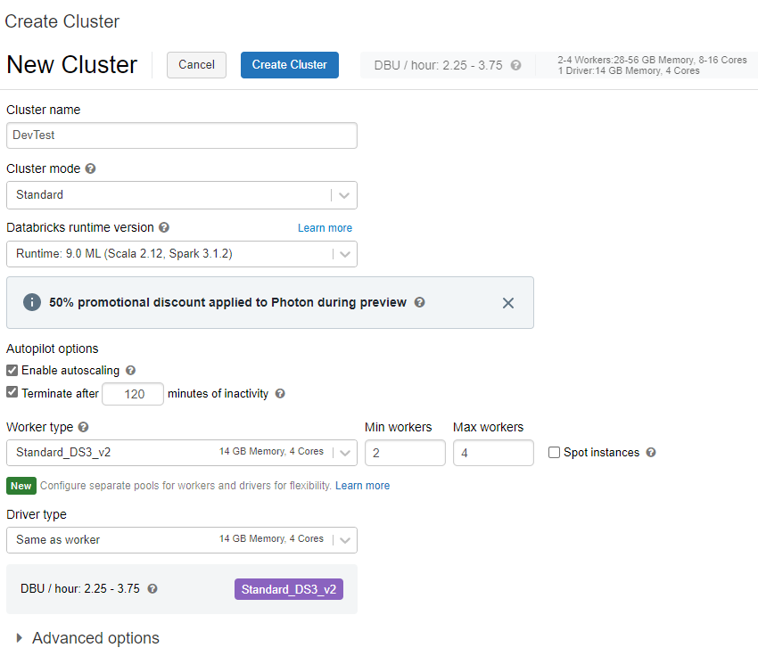

Once the cluster is created, click on Workspace ->Users and right click on the right panel and select Create -> Notebook -> Click on Create. Feel free to set your own values but as an example you can use these settings:

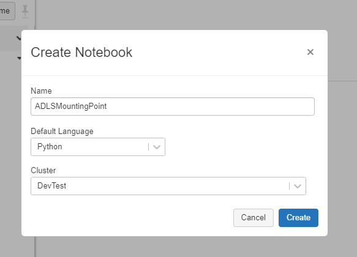

We now need to assign the Storage Blob Data Contributor role to the Storage Account we created. Go into your Resource Group and click on the Storage Account. Now click on the Access Control (IAM), click on Add Role Assignment. In the search bar write:Storage Blob Data Contributor -> click next:

Click on Select Members -> search for your Azure user account -> Click Select ->Review & Assign

Now copy the code from the provided ADLSMountingPoint notebook  and paste it on your own Azure Databricks Notebook. Alternatively you can download and import the provided ADLSMountingPoint into your Azure Databricks Workspace

We now need to create a Service Principal to create the mounting point with the ADLS. To do so, go back to the Azure Portal and search for App Registrations then click on 
+New Registration. Give it a name and click on Register. This is the name of your Service Principal!

After creating the Service Principal, click on it and from the left menu bar click on Certificates & secrets:

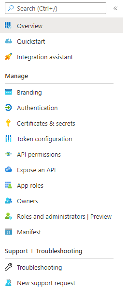

Click on New Client Secret, give it a name and set a duration, click on Add. Copy the value of the secret, make sure you store it in a safe place as you will see this only once!
After you safely stored the secret, click on the Overview Tab and take a note of the following fields:

- Application(Client ID)
- Directory (Tenant) ID

Now go to the Notebook you created in Azure Databricks and set the above value in your code as highlighted below:

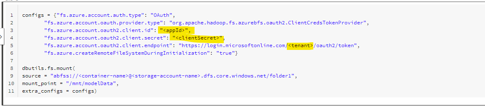

Now set the container's name and the storage account name in the "source" field of the code making sure it points to the "data" container we created earlier. As an example this is my settings:

source = "abfss://data@devdatalakemlops.dfs.core.windows.net"

mount_point = "/mnt/modelData"

Note: Make sure that the mount point is set as in my example above otherwise you'd need to modify the provided code to make it work. Do not run the code yet as we need to make sure your Service Principal has access to the Azure Data Lake Storage

We now need to assign a Storage Blob Data Contributor role to the Service Principle we created. Go into your Resource Group and click on the Storage Account. Now click on the Access Control (IAM), click on Add Role Assignment. In the search bar write:Storage Blob Data Contributor -> click next -> Click on Select Members -> search for your Service Principal name -> Click Select ->Review & Assign

You can now go back to your Databricks workspace and run the mounting point code. You only need to run the mounting point code in all your Azure Databricks workspaces once as they need to access the data from the Azure Data Lake. 

# Step 4: Create an Azure DevOps project 

Login into Azure DevOps(https://dev.azure.com/) and create a new Project:

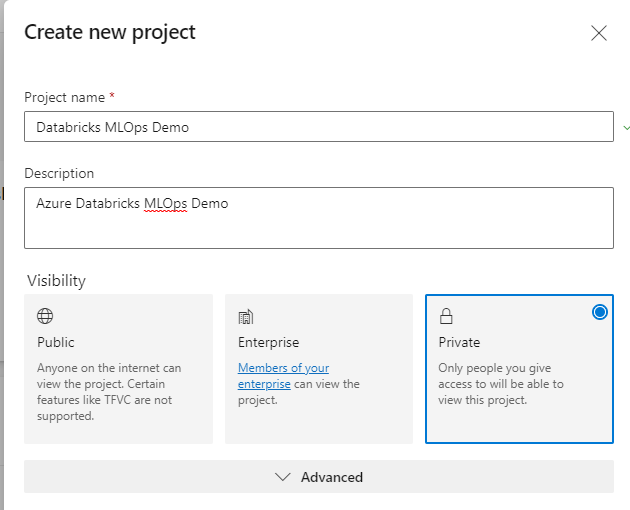

After creating an Azure DevOps repository, click on your repository name as highlighted in the screenshot below and select:Import Repository. Specify the URL of this Git repository and import it in Azure DevOps.

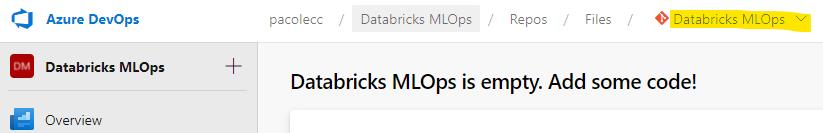

# Step 5: Add your Azure DevOps repository to the Azure Databricks Workspace

Login your Azure Databricks Development workspace, click on Repos from the left menu bar and click on Add Repo. Specify the URL of the Azure DevOps repo and click on create. 
The screenshot below shows how to get the Azure DevOps repo URL:

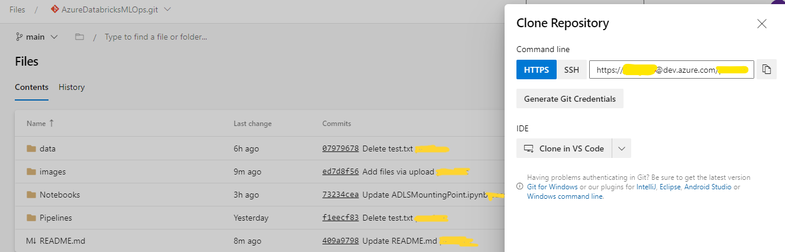

This screenshot shows how to paste the Azure DevOps repo URL into Azure Databricks Repos:

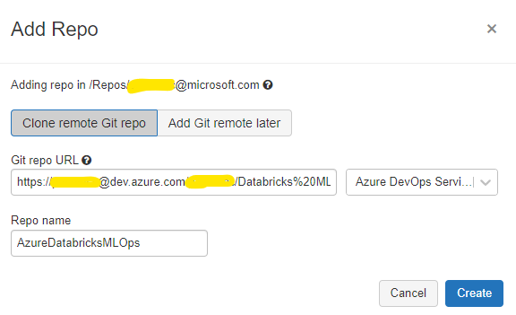

## Install MLFlow

After importing the Git repository into Azure Databricks, let's install the MLFlow library. Click on your Azure Databricks Cluster name -> Libraries and install MLFlow as per the screenshot below:

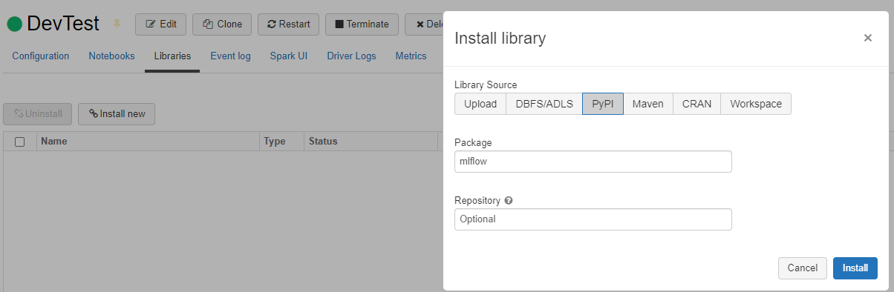

## Install databricks-cli

Now that we have all the clusters created and we imported the Azure DevOps repo into your Azure Databricks Development Workspace, we need to install the databricks-cli to configure the development. To install the Azure Databricks CLI you need to have Python 3.8+ installed on your local machine and then run this command from console: 

pip install databricks-cli

After the installation is completed you'll need to do the following steps:

1)  Login into your Azure Databricks DevTest workspace, click on Settings -> User Settings -> Generate New Token. Copy the newly created token
2)  Go on your console and type: databricks configure --token
3)  Specify your Databricks host for example: https://adb-5555555555555555.19.azuredatabricks.net/
4)  When prompted, specify the personal access token you previously created
5) To check all is set correctly, type this command: databricks workspace ls. It should output the Users, Shared and Repos folders

Now perform the following steps:

a) In the Production workspace, create an Access Token

b) Go on the command line and perform the steps mentioned in this paragraph: "Set up the API token for a remote registry" from this link: https://docs.microsoft.com/en-gb/azure/databricks/applications/machine-learning/manage-model-lifecycle/multiple-workspaces#set-up-the-api-token-for-a-remote-registry
Here as a reminder we are simulating that the Production workspace is also the shared registry. In reality the shared registry is a separate workspace. In that case you'd have needed to perform steps 1-5 above and point b) above for the Development, Test/Pre-Production, Production environment too.

# Step 6: Run the Notebooks from the Azure DevOps repo

Now go to the Development Databricks Workspace and click on Repos and execute the data_preprocessing notebook. After this notebook, please open the train-Spark-Model notebook and go to the Command 20; here you'd need to set the registry value as per the scope and prefix you created on point b) above. Run the notebook to train and register a model in the shared registry workspace(in our case as we only have 2 clusters, the shared registry will be the Production cluster)

# Step 7: Import the created MLOps pipelines in your Azure DevOps project

Go to your Azure DevOps project, click on Pipelines -> Create Pipeline and click on the Azure Repos Git YAML:

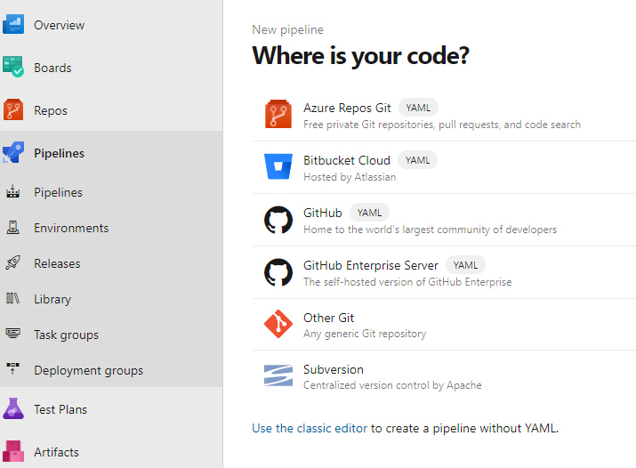

Select the Existing Azure Pipeline YAML file from the Pipeline repository folder. Click on Run the Pipeline

Now click on Releases, create a dummy pipeline and save it. Now download from the repository the Release Pipeline.json file from the Pipeline folder. Go back to the Azure DevOps project and click on Releases, click on the downfacing arrow next to +New and select Import Release Pipeline. Click on Browse and import the Release Pipeline.json file

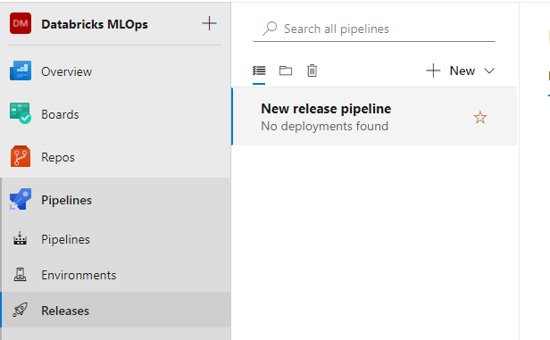

Now click on the Artifact, remove it and add the Artifact that you created when you ran the previous yaml pipeline. 

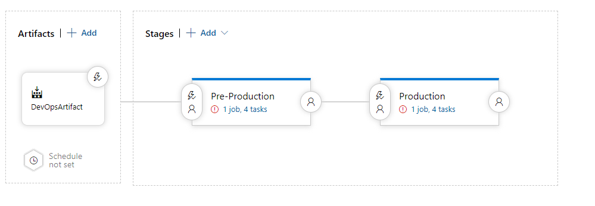

Click now on Pre-Production Task -> Agent Job -> Agent pool; set this to Azure Pipelines. Select windows-2019 for the Agent Specification field. Now click on the Variables link and set all the variables as per your environment. 

Now perform the same for the Production task. When finished the previous step, click on the Pre-production Tasks and click on the Databricks Notebook Deployment task -> Source files path. Click on the tree dots and select the Notebook folder from your own artifact. 
Do the same also for the Production Tasks. Make also sure that the Azure Region for the Databricks Notebook Deployment is right based on your environment. Please check this for the Pre-Production and Production Tasks.

Click on Create Release or feel free to kick start a build pipeline which should automatically start the release pipeline provided you enabled the Continuous Integration flag:

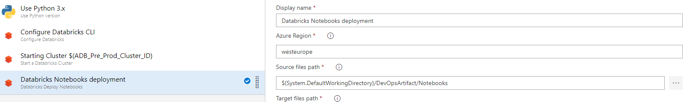

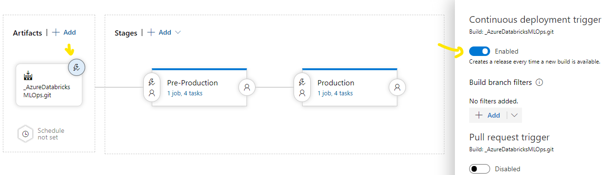

Once the release pipeline completes, go in each workspace you created and update the registry_uri="databricks://rmr:rmr" with the scope:prefix you created for that environment, Please update it in these Notebooks: Test-Pre-Prod-SparkModel,Promote-SparkModel-To-Production and Production_Batch_Scoring from the /Shared folder of the workspace.
Save the Notebooks.

# Step 8: Build an Azure Data Factory pipeline

Go to your resource group and create an Azure Data Factory service. For this demo and for simplicity don't enable the Git Integration for Data Factory; if you know how it works, feel free to enable and use it.

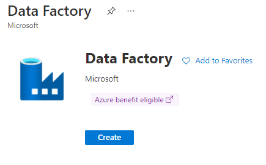

Once the service is created, click on the service name -> Open Azure Data Factory Studio
Click on the Author (Pencil icon) button, add a new Pipeline and add 2 Notebook tasks from the Databricks menu as per the screenshot below:

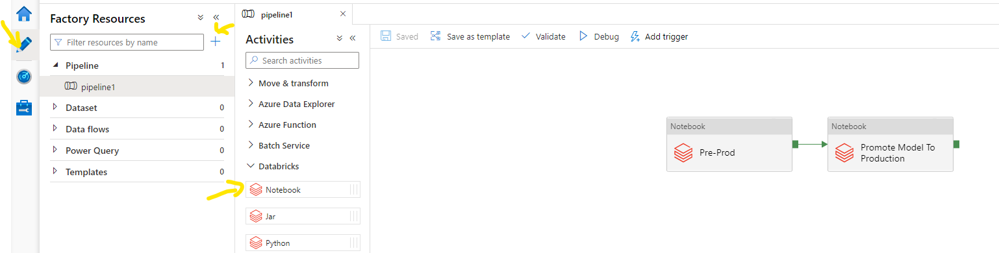

Connect the two Notebook tasks as per the screenshot above. Now click on the Manage task on the left menu bar and add two Azure Databricks linked Service; one for the DevTest environment and the other for Production. For Production deployment you will be adding one Linked Service per environment you created. Configure the Linked Service as per the information they require:

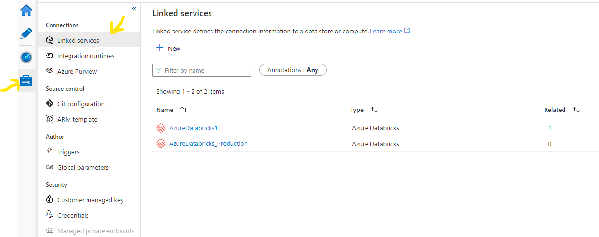

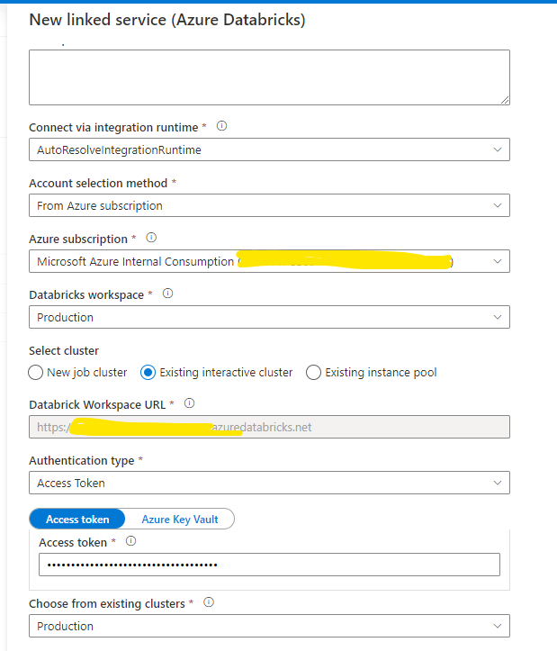

Now go back to your pipeline with the two Notebooks you added. Click on the first notebook task to configure it. Click on the Azure Databricks tab and connect it to the right linked Service you created.

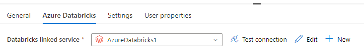

Now click on Settings and select : /Shared/Test-Pre-Prod-SparkModel. Make sure you select this notebook as the idea here is to test the model we created in development in the Test/Prep-Production environment
  
Now click on the second Notebook task, set the same Databricks Linked Service but select the Promote-SparkModel-To-Production notebook. Here the idea is that once the test is successful in the Test environment, we promote the model to Production for deployment

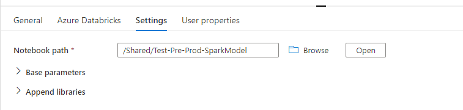
  
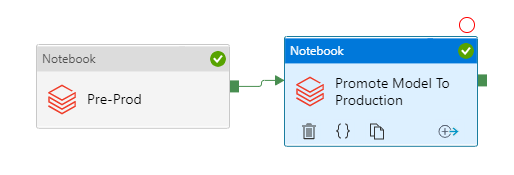

Now finally create another pipeline, add a new Databricks Notebook task, link it to the Production Databricks linked service and select the /Shared/Production_Batch_Scoring Notebook to run.

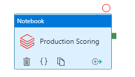

Run it and you will be batch scoring your spark model against the HoldoutDiabetes.csv file provided.

